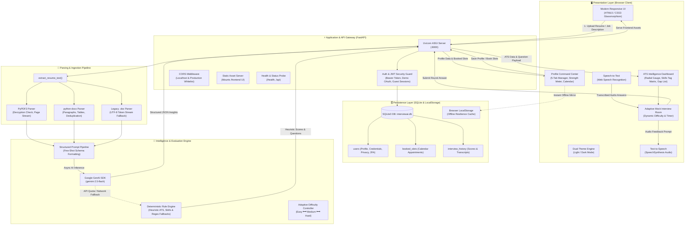

# 🤖 InterviewAI — Premium AI Resume Intelligence, Adaptive Mock Interview & Career Command Center

<p align="center">
  
  
  
  
  
  
  
</p>

---

## 📌 Executive Overview

**InterviewAI** is an enterprise-grade AI career copilot engineered to help developers, data scientists, and technical professionals master competitive hiring pipelines. 

By combining **Google Gemini 2.5 Flash**, deterministic ATS heuristics, browser-native bi-directional voice streaming (STT/TTS), and an integrated **SQLite Persistence Engine**, InterviewAI provides a full-lifecycle preparation platform:
1. **Resume Intelligence & Precision ATS Studio**: Multi-format document parser (`.pdf`, `.docx`, `.doc`), 0–100 radial ATS benchmark, role keyword-gap radar, and actionable bullet rewrites.
2. **Interactive Voice-Enabled Mock Interview Room**: AI-driven adaptive technical and behavioral simulation where difficulty dynamically adjusts (Easy ⟷ Medium ⟷ Hard) based on response depth, complete with real-time audio waveforms and spoken question delivery.
3. **Enterprise User Profile & Career Command Center**: A unified 5-section command center featuring 1-click resume synchronization, dynamic work experience and academic credential management, interactive skills tag badges, mock interview performance analytics, upcoming booked slots calendar, and enterprise security (privacy toggles, password strength validation, and Two-Factor Authentication).

---

## 📐 Project Blueprint & System Architecture

### 1. High-Level Architectural Blueprint



---

### 2. Visual Blueprint Map (ASCII Layout)

```text
==================================================================================================
                                    INTERVIEWAI SYSTEM BLUEPRINT                                  
==================================================================================================

  [ USER / CANDIDATE ]
          │
          ├── (1) Resume Upload (PDF / DOCX / DOC) & Job Target Alignment
          ├── (2) Voice-Enabled Mock Interview (Web Speech STT / TTS)
          ├── (3) Full 5-Tab Profile Command Center & Interview Slot Calendar
          │
          ▼
┌────────────────────────────────────────────────────────────────────────────────────────────────┐
│ 1. FRONTEND PRESENTATION LAYER (Vanilla HTML5 / Modern CSS3 / ES6+ JavaScript)                 │
│  ├─ 5-Tab Command Center      ── Basic Info, Preferences, Background, Metrics, Settings        │
│  ├─ Profile Strength Meter    ── Real-time calculated completeness gauge (0-100%)              │
│  ├─ 3D CSS Neural Core        ── Pure CSS transforms with orbiting particle animations         │
│  ├─ Dual Theme Controller     ── Automatic light/dark palette with localStorage sync           │
│  ├─ Radial ATS Meter          ── Dynamic SVG gauge (0-100) with category-level breakdown       │
│  ├─ Web Speech Engine         ── Bi-directional voice dictation & speech synthesis             │
│  └─ Dual-Tier Persistence     ── FastAPI cloud sync mirrored to localStorage for offline ease   │
└────────────────────────────────────────┬───────────────────────────────────────────────────────┘
                                         │ REST API Calls (JSON / Multipart / Bearer JWT)
                                         ▼
┌────────────────────────────────────────────────────────────────────────────────────────────────┐
│ 2. ASGI BACKEND GATEWAY (FastAPI / Uvicorn @ port 8000)                                        │
│  ├─ Authentication Engine     ── JWT Bearer tokens, Demo OAuth (Google/LinkedIn), Guest Login  │
│  ├─ CORS Security Middleware  ── Allows localhost, 127.0.0.1, custom domains & Netlify         │
│  ├─ Static Asset Mount        ── Unified server hosting frontend UI and API from single port   │
│  ├─ Input Validation          ── Size guards (10MB max), character caps, format enforcement    │
│  └─ Health Diagnostic         ── Returns backend status, active model, and Gemini API readiness│
└───────────────────┬────────────────────────────────────────────┬───────────────────────────────┘
                    │                                            │
                    ▼                                            ▼
┌──────────────────────────────────────┐     ┌───────────────────────────────────────────────────┐
│ 3. PERSISTENCE LAYER (SQLite3)       │     │ 4. AI & RESILIENT INFERENCE ENGINE                │
│  ├─ users Table                      │     │  ├─ Google GenAI SDK (gemini-2.5-flash)           │
│  │   └─ Contact, Socials, 2FA, CV    │     │  │   └─ Deep role alignment & ATS scoring         │
│  ├─ booked_slots Table               │     │  ├─ Prompt Builder & Schema Guard                 │
│  │   └─ Calendar appointments        │     │  │   └─ Strict JSON outputs & candidate sandboxing│
│  ├─ interview_history Table          │     │  ├─ Adaptive Difficulty Controller                │
│  │   └─ Evaluated scores & sessions  │     │  │   └─ Adjusts complexity (Easy -> Med -> Hard)  │
│  └─ Ingestion Pipeline (PDF/DOCX/DOC)│     │  └─ Heuristic Fallback Engine                     │
│      └─ PyPDF2 & python-docx parsers │     │      └─ Automatic fallback on 429/500/offline     │
└──────────────────────────────────────┘     └───────────────────────────────────────────────────┘
                                         │
                                         ▼
┌────────────────────────────────────────────────────────────────────────────────────────────────┐
│ 5. INTELLIGENCE OUTPUT & CANDIDATE REPORTING                                                   │
│  ├─ ATS Benchmark Score (0–100) categorized by Skills, Experience, Education, and Keywords    │
│  ├─ Role Alignment % & Extracted Technical vs. Soft Competencies                              │
│  ├─ 8-Round Adaptive Technical & HR Mock Interview Session                                    │
│  ├─ Scheduled Interview Slot Management with Custom Interviewer Personas                      │
│  └─ End-of-Session Performance Card, Readiness Rating, and Career Study Plan                   │
==================================================================================================
```

---

## 🌟 The 5-Section Profile & Career Command Center

The platform includes a dedicated **User Profile and Career Command Center** organized into 5 functional areas:

```text
┌──────────────────────────────────────────────────────────────────────────────────────────────┐
│                                HERO CANDIDATE BANNER                                         │
│  [Avatar / Photo Picker]   Dr. Alex Mercer · Senior Fullstack Engineer & AI Practitioner     │
│  Status: [🟢 Actively Interviewing]   Sessions: 3   Avg Score: 85%   Readiness: Interview Ready│
│  Profile Strength Meter: [██████████████████████░░░░] 85%                                    │
└──────────────────────────────────────────────────────────────────────────────────────────────┘
│ [Tab 1: Basic Info] │ [Tab 2: Preferences] │ [Tab 3: Background] │ [Tab 4: Metrics] │ [Tab 5: Settings] │
```

### 1. Basic & Contact Information (Pehchan aur Sampark)
* **Full Name & Professional Title / Headline**: Displayed prominently in the hero banner and recruiter views (e.g. *Senior Frontend Developer*, *Data Analyst Fresher*).
* **Passport-Style Photo Picker**: Studio portrait presets or custom image upload (JPG, PNG, WebP) with instant avatar preview.
* **Contact Details**: Email ID, Phone Number, Location (City/Country), and Primary Academic Field.
* **Social & Professional Online Presence**: Verified profile links for **LinkedIn**, **GitHub**, **Portfolio Website**, **Behance**, and **Dribbble**.

### 2. Interview & Job Preferences (Pasand aur Target)
* **Interactive Job Search Status Selector**: 1-click toggle buttons that immediately synchronize with the hero status pill:
  - 🟢 **Actively Interviewing**: Prioritized for urgent screens and recruiter offers.
  - 🔵 **Open to Offers**: Casually exploring high-alignment opportunities.
  - 🟡 **Just Practicing**: Mock preparation mode; not currently seeking roles.
* **Target Roles & Seniority Level**: Primary target career titles and seniority dropdown (Fresher, Junior, Mid-Level, Senior, Lead/Principal).
* **Flexible Job Types**: Interactive multi-select chips for *Full-time*, *Remote*, *Part-time*, *Internship*, and *Contract*.
* **Preferred Location**: Target cities, domestic regions, or remote options.

### 3. Professional Background (Anubhav aur Kshamta)
* **1-Click Resume / CV Document Manager**: Drag-and-drop upload zone supporting `.pdf`, `.docx`, and `.doc` (up to 10MB) with upload timestamps and **1-Click Resume Download**.
* **Dynamic Work Experience History**: Add, edit, and delete prior employment records with Job Title, Company, Attendance Duration, and Key Contributions.
* **Dynamic Academic Education History**: Add and remove degree credentials with Degree Title, Field of Study, Institution Name, Graduation Years, and Honors/GPA.
* **Interactive Skills Tag Manager**:
  - **Technical Skills**: Type and press Enter or click 1-click suggestion badges (`+ Python`, `+ React`, `+ TypeScript`, `+ Docker`, `+ FastAPI`, `+ System Design`, `+ AWS`).
  - **Soft Skills**: Dedicated tag chip manager with suggestions (`+ Communication`, `+ Leadership`, `+ Problem Solving`, `+ Agile Mindset`, `+ Mentorship`).
  - Each chip features an interactive remove (`×`) trigger.
* **Extracurricular & Holistic Accomplishments**: Quick-select badges for choir leadership, folk music, olympiads, debate, and hackathons with freeform text.

### 4. Website-Specific Features (Interview Performance Metrics)
* **Mock Interview Performance Dashboard**:
  - **Overall Average Score** (%)
  - **Technical Average Score** (%)
  - **HR & Behavioral Average Score** (%)
  - **Questions Solved** counter across all practice rounds
  - **Readiness Rating** badge (*Interview Ready*, *Intermediate*, *Needs Practice*)
* **Proven Mastery vs. Focus Areas**: Visual insight boxes identifying specific strengths (e.g. *System Architecture*, *Data Structures*) and weak areas (e.g. *STAR conflict anecdotes*, *Edge-case explanations*).
* **Booked Slots & Interview Calendar**:
  - View upcoming booked sessions with date, time, title, role, interviewer persona, and notes.
  - Interactive **Schedule Mock Interview** modal to book future sessions with diverse interviewer personas (*AI Adaptive Interviewer*, *Strict FAANG Bar Raiser*, *Behavioral HR Specialist*, *System Architect Lead*).
  - 1-click slot cancellation.
* **Past Feedback & Detailed Reports**: Expandable accordion detailing historical interview transcripts, AI evaluation critiques, and coaching tips.

### 5. Account Settings & Privacy (Suraksha aur Settings)
* **Recruiter Visibility Control**: Toggle between **Public Candidate Profile** (discoverable by verified hiring teams) and **Private Incognito Mode** (completely hidden).
* **Notification Preferences**: Independent switches for Email interview reminders, SMS alerts, and Weekly performance digests.
* **Password Change**: Form with current password verification, new password length validation (minimum 6 characters), and confirmation checking.
* **Two-Factor Authentication (2FA)**: Two-step account protection with status badge (`Enabled 🟢` / `Disabled ⚪`), toggle trigger, and verification modal featuring an authenticator QR code mockup and 6-digit TOTP code entry.

---

## ✨ Full Features Matrix

| Feature | Category | Description |
| :--- | :--- | :--- |
| **📄 Multi-Format Resume Parser** | Resume Studio | In-memory parser supporting `.pdf`, `.docx`, and `.doc` with password checks and table deduplication. |
| **📊 Radial ATS Score Gauge** | Resume Studio | Dynamic SVG score gauge (0–100) with diagnostic breakdown for Skills, Experience, Education, and Keywords. |
| **🎯 Job Description Match Radar** | Resume Studio | Keyword-frequency comparative matrix cross-referencing candidate background against specific target job listings. |
| **💡 Action-Verb Bullet Rewrites** | Resume Studio | High-impact optimization suggestions formatted using the *Action-Verb + Task + Outcome* standard. |
| **🎙️ Speech-to-Text Voice Dictation** | Mock Interview | Speak answers aloud using browser-native Web Speech API with real-time waveform animations. |
| **🔊 Text-to-Speech Question Reader** | Mock Interview | Listen to simulated interviewer questions spoken aloud with native browser speech synthesis. |
| **🔄 Dynamic Adaptive Difficulty** | Mock Interview | Multi-round technical & behavioral interview where questions dynamically adjust between *Easy*, *Medium*, and *Hard*. |
| **📋 Comprehensive Scorecard** | Mock Interview | Post-interview performance evaluation with communication critique, model answers, and study tips. |
| **👤 5-Tab Profile Command Center**| Profile System | Comprehensive candidate profile covering Contact, Preferences, Background, Metrics, and Settings. |
| **📅 Booked Slots Calendar** | Profile System | Schedule, view, and cancel upcoming mock interviews with custom interviewer personas. |
| **🏷️ Interactive Skills Tag Manager**| Profile System | Technical and soft skills badges with instant suggestions, keyboard input, and 1-click deletion. |
| **🔒 Enterprise Security & 2FA** | Profile System | Recruiter visibility toggle, password change validation, and Two-Factor Authentication controls. |
| **🌓 Dual-Theme System** | UI / UX | Polished SaaS interface supporting dark and light modes with smooth transitions and `localStorage` persistence. |
| **⚡ 1-Click Quick Testing** | Demo Tools | Preloaded sample profiles (*Dr. Alex Mercer*, *Maya Lin*) and sample resumes for instant testing. |

---

## 🛠️ Technology Stack

### Frontend Client
* **Markup & Structure:** Semantic HTML5 (WCAG 2.1 accessible)
* **Styling & Design System:** Vanilla CSS3 with CSS Custom Properties (Variables), Glassmorphism, 3D CSS Transforms, Responsive Flexbox/Grid
* **Client Logic & State:** Modern ES6+ JavaScript (Async/Await, Event Delegation, DOM API)
* **Browser Web APIs:** Web Speech Recognition (`SpeechRecognition` / `webkitSpeechRecognition`), SpeechSynthesis Audio API, LocalStorage API, Clipboard API, FileReader API
* **Icons & Typography:** Inter typeface (Google Fonts), Font Awesome 6.7.2

### Backend Server & Persistence
* **Language & Runtime:** Python 3.12+
* **Web Framework:** FastAPI with Starlette & Uvicorn ASGI
* **Database & ORM:** SQLite 3 (`backend/interviewai.db`) with automatic idempotent migrations
* **Authentication:** JWT Bearer tokens, PBKDF2/SHA256 password hashing, Demo OAuth providers (Google, LinkedIn)
* **Document Extraction:** `PyPDF2` (PDFs) and `python-docx` (Word Documents)
* **AI Intelligence Engine:** `google-genai` SDK targeting **Google Gemini 2.5 Flash**
* **Configuration:** `python-dotenv`
* **Automated Testing:** `pytest`, `httpx` (20 comprehensive automated tests)

---

## 📂 Project Directory Structure

```text
ai-interview-assistant/
│
├── frontend/                          # Client-side presentation layer
│   ├── index.html                     # Semantic layout: Resume Studio, Interview Room, 5-Tab Profile
│   ├── style.css                      # Design system tokens, light/dark themes, tab styles, 3D core
│   ├── script.js                      # Voice STT/TTS, ATS scoring, 5-tab profile manager, slot calendar
│   ├── config.js                      # Runtime backend API base URL resolver
│   └── sample-resumes/                # Bundled sample resumes for instant 1-click testing
│       ├── sample_software_developer_resume.pdf
│       └── sample_software_developer_resume.docx
│
├── backend/                           # FastAPI backend server
│   ├── main.py                        # FastAPI routes, CORS, validation, Gemini AI & heuristic fallback
│   ├── database.py                    # SQLite engine, schema migrations, profile CRUD, slot booking
│   ├── requirements.txt               # Backend-specific dependencies
│   ├── .env                           # Local environment variables (API keys, ports)
│   ├── .env.example                   # Template environment configuration
│   │
│   ├── services/                      # Modular backend domain services
│   │   ├── document_parser.py         # Multi-format document parser (PDF, DOCX, DOC)
│   │   └── resume_extractor.py        # Skills extraction, ATS calculation & fallback generation
│   │
│   └── tests/                         # Automated test suite (20 tests passing)
│       ├── test_api.py                # 13 tests: Ingestion, ATS, health, mock interview endpoints
│       ├── test_auth_profile.py       # 5 tests: JWT authentication, OAuth demo login, profile CRUD
│       └── test_full_profile.py       # 2 tests: Comprehensive 5-section profile, slots, resume, 2FA
│
├── main.py                            # Root ASGI launcher (entrypoint for uvicorn)
├── run_backend.bat                    # 1-Click Windows batch launcher
├── requirements.txt                   # Master Python dependencies list
├── .env                               # Root environment configuration
├── .env.example                       # Root environment configuration template
├── Dockerfile                         # Production containerization manifest
├── netlify.toml                       # Netlify deployment configuration
├── render.yaml                        # Render deployment configuration
└── README.md                          # Comprehensive documentation & architectural blueprint
```

---

## 📡 Complete REST API Specification

### 1. Core AI & Resume Studio Routes
| Method | Endpoint | Description | Request Payload | Response Schema |
| :--- | :--- | :--- | :--- | :--- |
| `GET` | `/` | Serves the unified frontend SPA | None | HTML Webpage |
| `GET` | `/health` | Diagnostic health check & AI status | None | `{"status": "ok", "gemini_configured": bool, "model": str}` |
| `GET` | `/api` | API handshake & version metadata | None | `{"success": true, "message": str, "version": str}` |
| `POST` | `/analyze-resume` | Parses resume & computes complete ATS analysis | `multipart/form-data`<br/>• `resume`: File<br/>• `role`: String<br/>• `job_description`: Optional | `{"success": true, "analysis": str, "dashboard": {...}}` |
| `POST` | `/adaptive-interview` | Evaluates single answer & yields next question | `application/json`<br/>• `role`: String<br/>• `question`: String<br/>• `answer`: String<br/>• `difficulty`: String | `{"success": true, "evaluation": {...}, "next_question": {...}}` |
| `POST` | `/evaluate-interview` | Final comprehensive evaluation (persists to DB) | `application/json`<br/>• `role`: String<br/>• `answers`: Array of Q&A objects | `{"success": true, "evaluation": str}` |

### 2. Authentication & Session Routes
| Method | Endpoint | Description | Request Payload | Response Schema |
| :--- | :--- | :--- | :--- | :--- |
| `POST` | `/auth/guest-login` | Generates a persistent guest JWT session | None | `{"access_token": str, "user": {...}}` |
| `POST` | `/auth/demo-login` | Instant demo login for Google or LinkedIn | `{"provider": "google" \| "linkedin"}` | `{"access_token": str, "user": {...}}` |
| `GET` | `/auth/google` | OAuth redirect endpoint for Google | None | Redirect / Token |
| `GET` | `/auth/linkedin` | OAuth redirect endpoint for LinkedIn | None | Redirect / Token |
| `GET` | `/api/auth/me` | Fetch authenticated session metadata | Bearer Header | `{"user": {...}}` |

### 3. User Profile & Interview Management Routes
| Method | Endpoint | Description | Request Payload | Response Schema |
| :--- | :--- | :--- | :--- | :--- |
| `GET` | `/api/profile` | Retrieve full 5-section user profile | Bearer Header | `{"profile": {...}}` |
| `PUT` | `/api/profile` | Update profile fields across all 5 areas | `application/json`<br/>Full profile schema | `{"success": true, "profile": {...}}` |
| `POST` | `/api/profile/booked-slots` | Schedule an upcoming mock interview slot | `{"title": str, "role": str, "slot_date": str, "slot_time": str, ...}` | `{"success": true, "slot": {...}}` |
| `DELETE` | `/api/profile/booked-slots/{slot_id}` | Cancel/delete a scheduled interview slot | URL path parameter | `{"success": true}` |
| `POST` | `/api/profile/resume` | Upload Base64 PDF/DOC resume document | `{"filename": str, "file_base64": str}` | `{"success": true, "filename": str, "uploaded_at": str}` |
| `GET` | `/api/profile/resume/download` | 1-Click download of active candidate resume | Bearer Header | File binary download |
| `POST` | `/api/profile/change-password` | Update account credentials with validation | `{"current_password": str, "new_password": str}` | `{"success": true}` |
| `POST` | `/api/profile/toggle-2fa` | Enable/disable Two-Factor Authentication | `{"enable": bool, "verification_code": Optional}` | `{"success": true, "two_factor_enabled": bool}` |

---

## 🚀 Getting Started & Local Setup

### 1. Prerequisites
* **Python:** Python 3.12 or newer installed ([python.org](https://www.python.org/))
* **Google Gemini API Key:** Free API key from [Google AI Studio](https://aistudio.google.com/) *(Optional: heuristic rule engine works offline even without a key)*

---

### 2. Fast Launch (Windows 1-Click)
Simply double-click the included batch script:
```text
run_backend.bat
```
This automatically locates Python, checks dependencies, and launches the unified server at `http://127.0.0.1:8000`.

---

### 3. Manual Setup (macOS / Linux / Windows)

#### Step 1: Clone the Repository
```bash
git clone https://github.com/your-username/ai-interview-assistant.git
cd ai-interview-assistant
```

#### Step 2: Set Up a Virtual Environment (Recommended)
```bash
# Windows
python -m venv .venv
.\.venv\Scripts\activate

# macOS / Linux
python3 -m venv .venv
source .venv/bin/activate
```

#### Step 3: Install Dependencies
```bash
pip install -r requirements.txt
```

#### Step 4: Configure Environment Variables (.env)
Create a `.env` file in the root directory (or copy `.env.example`):
```ini
PORT=8000
ENVIRONMENT=development
GEMINI_API_KEY=your_actual_gemini_api_key_here
GEMINI_MODEL=gemini-2.5-flash
FRONTEND_URL=http://localhost:3000,http://127.0.0.1:5500
```

#### Step 5: Start the Server
```bash
# Using the root launcher:
python main.py

# Or directly with uvicorn:
uvicorn backend.main:app --host 0.0.0.0 --port 8000 --reload
```

#### Step 6: Access the Application
Open your browser and navigate to:
* **Web App:** [http://127.0.0.1:8000/](http://127.0.0.1:8000/)
* **Profile Command Center:** [http://127.0.0.1:8000/#profile](http://127.0.0.1:8000/#profile)
* **Interactive API Documentation (Swagger):** [http://127.0.0.1:8000/docs](http://127.0.0.1:8000/docs)
* **Alternative API Documentation (ReDoc):** [http://127.0.0.1:8000/redoc](http://127.0.0.1:8000/redoc)

---

## 🧪 Automated Testing Suite

The repository contains an enterprise-grade automated test suite with **20 passing tests** covering all modules:

```bash
python -m pytest backend/tests
```

```text
============================= test session starts =============================
platform win32 -- Python 3.13.x, pytest-9.1.1, pluggy-1.6.0
rootdir: D:\ai-interview-assistant-main\ai-interview-assistant
plugins: anyio-4.14.2
collected 20 items

backend\tests\test_api.py .............                                  [ 65%]
backend\tests\test_auth_profile.py .....                                 [ 90%]
backend\tests\test_full_profile.py ..                                    [100%]

============================== 20 passed in 2.09s ==============================
```

### Test Suite Breakdown:
1. `backend/tests/test_api.py` (13 tests):
   - Health diagnostics and API metadata verification.
   - Document parsing across `.pdf`, `.docx`, and `.doc` formats.
   - Boundary validations for missing files, oversized files, and invalid formats.
   - Heuristic ATS calculation accuracy and fallback generation.
   - Adaptive mock interview answer evaluation and difficulty adjustment.
2. `backend/tests/test_auth_profile.py` (5 tests):
   - Unauthenticated access protections.
   - Demo OAuth sign-in flow for Google and LinkedIn.
   - Guest session generation and `/api/auth/me` user profile queries.
   - Profile updating and persistence.
3. `backend/tests/test_full_profile.py` (2 tests):
   - Complete 5-section profile CRUD validation (Contact, Preferences, Skills, Work Experience, Education, Settings).
   - Booked slots scheduling and deletion workflows.
   - Resume base64 upload and 1-click download endpoints.
   - Password updating and Two-Factor Authentication (2FA) state transitions.

---

## 💡 Troubleshooting Common Issues

<details>
<summary><b>1. "Cannot connect to AI backend at http://127.0.0.1:8000"</b></summary>

* **Cause:** The backend server is not running, or is bound to a different port.
* **Fix:** Run `run_backend.bat` or `python main.py` in your terminal. Ensure the terminal output displays `Uvicorn running on http://0.0.0.0:8000`.
</details>

<details>
<summary><b>2. "Python was not found; run without arguments to install from the Microsoft Store"</b></summary>

* **Cause:** Windows App Execution Aliases are overriding the python command, or Python was installed without checking "Add python.exe to PATH".
* **Fix:** Either run using `py main.py`, or disable the app execution alias in **Windows Settings > Apps > Advanced app settings > App execution aliases**.
</details>

<details>
<summary><b>3. Microphone Voice Dictation Not Responding</b></summary>

* **Cause:** Browser permissions are blocked, or the app is accessed over unencrypted remote HTTP.
* **Fix:** The Web Speech API requires `localhost`, `127.0.0.1`, or an `HTTPS` connection. Ensure you have granted microphone access in your browser's site permissions.
</details>

<details>
<summary><b>4. Changes to Profile Not Persisting After Restart</b></summary>

* **Cause:** Running without SQLite write permissions in the directory.
* **Fix:** The application uses SQLite (`backend/interviewai.db`) and automatically falls back to `localStorage` caching. Ensure the user account has write permissions to the repository directory.
</details>

---

## 📅 Changelog

### Version 3.0.0 (Latest Release)
* **Enterprise 5-Tab Profile Command Center**:
  - Implemented 5 complete management tabs: *Basic Info*, *Preferences*, *Background*, *Metrics & Calendar*, and *Settings & Privacy*.
  - Added live Profile Strength Meter with real-time completeness percentage calculation.
  - Added Studio Portrait photo picker with presets and custom image upload.
* **Interactive Job Search Status Selector**:
  - Added 1-click status switcher (*Actively Interviewing*, *Open to Offers*, *Just Practicing*) with color-coded status pills.
* **Calendar & Booked Slots System**:
  - Built interactive scheduling modal supporting multiple interviewer personas (*AI Adaptive*, *Strict FAANG*, *Behavioral HR*, *System Architect*).
  - Implemented slot creation, listing, and cancellation API endpoints.
* **Interactive Skills Tag Managers**:
  - Added technical and soft skills badge managers with suggested chips and delete triggers.
* **Resume Document Uploader & 1-Click Downloader**:
  - Added drag-and-drop resume upload zone and instant binary download.
* **Account Privacy & Two-Factor Authentication**:
  - Built recruiter visibility toggle, notification preferences, password updates, and 2FA configuration modal.
* **Expanded Automated Test Suite**:
  - Increased test coverage from 13 to **20 passing automated tests** (100% green).

### Version 2.1.0
* Added comprehensive **System Architecture Blueprint** and **ASCII Data Flow Diagram**.
* Added Windows 1-click startup automation via `run_backend.bat`.
* Upgraded to Google GenAI SDK with Gemini 2.5 Flash support.
* Enhanced dual-tier heuristic fallback engine ensuring 100% platform uptime even under rate limits.

### Version 2.0.0
* Complete SaaS visual redesign with custom CSS glassmorphic tokens.
* Integrated Web Speech API microphone dictation and text-to-speech audio question reader.
* Added pure CSS 3D neural rotating visual.
* Built 1-Click sample resume quick-test functionality.
* Added dark/light mode toggle with `localStorage` persistence.

---

## 📄 License

This project is licensed under the **MIT License** — feel free to use it for personal career preparation or commercial enhancements.
