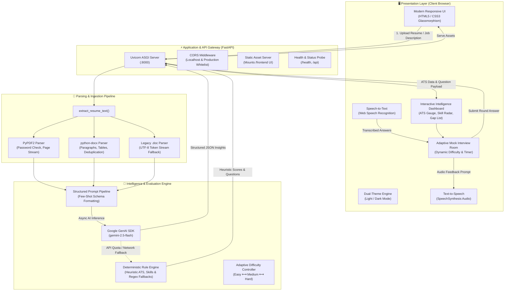

# 🤖 InterviewAI — Premium AI Resume Intelligence & Adaptive Mock Interview Platform

<p align="center">
  
  
  
  
  
  
</p>

---

## 📌 Overview

**InterviewAI** is an enterprise-grade AI career copilot designed to help software engineers, data scientists, and tech professionals ace competitive hiring pipelines. 

By combining **Google Gemini 2.5 Flash** with deterministic heuristics and in-browser voice synthesis, InterviewAI parses resumes across multiple formats, calculates precision ATS scores, detects keyword gaps against target job descriptions, and conducts interactive **voice-enabled adaptive mock interviews** with real-time feedback.

---

## 📐 Project Blueprint & System Architecture

### 1. High-Level Architectural Blueprint



---

### 2. Visual Blueprint Map (ASCII Layout)

```text
==================================================================================================
                                    INTERVIEWAI SYSTEM BLUEPRINT                                  
==================================================================================================

  [ USER / CANDIDATE ]
          │
          ├── (1) Upload Resume (PDF / DOCX / DOC) & Job Role
          ├── (2) Speak Answers via Microphone (Speech-to-Text)
          └── (3) Listen to Questions via TTS Audio Player
          │
          ▼
┌────────────────────────────────────────────────────────────────────────────────────────────────┐
│ 1. FRONTEND INTERFACE LAYER (Vanilla HTML5 / CSS3 / ES6+ JavaScript)                           │
│  ├─ 3D CSS Neural Core        ── Pure CSS transforms with orbiting particles                   │
│  ├─ Dual Theme Controller     ── Automatic light/dark palette with localStorage sync           │
│  ├─ Radial ATS Meter          ── Dynamic SVG gauge (0-100) with category breakdown            │
│  ├─ Web Speech Engine         ── Bi-directional voice dictation & speech synthesis             │
│  └─ Dynamic State Manager     ── Session caching, restart handlers & clipboard copy            │
└────────────────────────────────────────┬───────────────────────────────────────────────────────┘
                                         │ REST API Calls (Fetch / Multipart)
                                         ▼
┌────────────────────────────────────────────────────────────────────────────────────────────────┐
│ 2. ASGI BACKEND GATEWAY (FastAPI / Uvicorn @ port 8000)                                        │
│  ├─ CORS Security Middleware  ── Allows localhost, 127.0.0.1, custom domains & Netlify        │
│  ├─ Static Asset Mount        ── Unified server hosting frontend UI and API from single port   │
│  ├─ Input Validation          ── Size guards (5MB max), character caps, format enforcement     │
│  └─ Health Diagnostic         ── Returns backend status, active model, and Gemini API readiness│
└────────────────────────────────────────┬───────────────────────────────────────────────────────┘
                                         │
                 ┌───────────────────────┴───────────────────────┐
                 ▼                                               ▼
┌──────────────────────────────────────┐     ┌───────────────────────────────────────────────────┐
│ 3. DOCUMENT INGESTION PIPELINE       │     │ 4. AI & RESILIENT INFERENCE ENGINE                │
│  ├─ PyPDF2 Reader                    │     │  ├─ Google GenAI SDK (gemini-2.5-flash)           │
│  │   └─ Decryption check & streaming │     │  │   └─ Deep role alignment & ATS scoring         │
│  ├─ python-docx Reader               │     │  ├─ Prompt Builder & Schema Guard                 │
│  │   └─ Paragraph & table extraction │     │  │   └─ Strict JSON outputs & candidate sandboxing│
│  └─ Legacy .doc Stream Fallback      │     │  ├─ Adaptive Difficulty Controller                │
│      └─ Printable token scanner      │     │  │   └─ Adjusts complexity (Easy -> Med -> Hard)  │
└──────────────────────────────────────┘     │  └─ Heuristic Fallback Engine                     │
                                             │      └─ Automatic fallback on 429/500/offline     │
                                             └───────────────────────────────────────────────────┘
                                         │
                                         ▼
┌────────────────────────────────────────────────────────────────────────────────────────────────┐
│ 5. INTELLIGENCE OUTPUT & MOCK INTERVIEW ROOM                                                   │
│  ├─ ATS Benchmark Score (0–100) categorized by Skills, Experience, Education, and Keywords    │
│  ├─ Role Alignment % & Extracted Technical vs. Soft Competencies                              │
│  ├─ Missing Keyword Gap Analysis & Action-Verb Improvement Checklist                          │
│  ├─ 8-Round Adaptive Technical & HR Mock Interview Session                                    │
│  └─ Final Performance Assessment, Scorecards & Next-Step Career Study Plan                    │
==================================================================================================
```

---

### 3. End-to-End Execution Flow

```text
[Resume Upload] ──> [Format Validation] ──> [Text Normalization]
                                                    │
                                                    ▼
[Real-Time Dashboard] <── [JSON Parsing] <── [Gemini 2.5 Flash / Fallback]
       │
       ├──> ATS Score (0-100) & Metric Breakdown
       ├──> Strengths, Missing Keywords & Project Recommendations
       │
       ▼
[Adaptive Mock Interview Room]
       │
       ├──> Round N: TTS reads question aloud
       ├──> User records response using microphone (Speech-to-Text)
       ├──> Evaluated by AI ──> Difficulty adjusts for Round N+1
       │
       ▼
[Final Evaluation Report & Readiness Scorecard]
```

---

## ✨ Key Features Breakdown

| Feature | Description |
| :--- | :--- |
| **📄 Multi-Format Resume Ingestion** | Robust in-memory parser supporting `.pdf`, `.docx`, and `.doc` with password protection checks and table deduplication. |
| **📊 Visual ATS Radial Score Gauge** | Real-time SVG score gauge (0–100) with diagnostic breakdown for *Skills Match*, *Experience Relevance*, *Education Formatting*, and *Keyword Density*. |
| **🎯 Job Description Match Radar** | Keyword-frequency comparative matrix cross-referencing candidate background against specific target job listings. |
| **🔍 Structured Skill Extraction** | Automatically segments technical competencies, cloud platforms, frameworks, and interpersonal skills into interactive tags. |
| **💡 Actionable Improvement Checklist** | High-impact resume optimization suggestions formatted using the *Action-Verb + Task + Outcome* standard. |
| **🎙️ Speech-to-Text Voice Dictation** | Answer interview questions aloud using browser-native Web Speech API with real-time waveform pulse animations. |
| **🔊 Text-to-Speech Question Reader** | Listen to simulated interviewer questions spoken aloud with native browser speech synthesis. |
| **🔄 Dynamic Adaptive Difficulty** | Multi-round technical & behavioral interview where questions dynamically adjust between *Easy*, *Medium*, and *Hard* based on response depth. |
| **📋 End-of-Session Performance Card** | Comprehensive post-interview scorecard offering overall readiness rating, communication critique, model answers, and study tips. |
| **🌓 Dual-Theme System** | Polished SaaS interface supporting dark and light modes with smooth transitions and `localStorage` persistence. |
| **⚡ 1-Click Quick Testing** | Instant 1-click sample resume loader to test the entire platform without uploading personal documents. |

---

## 🛠️ Technology Stack

### Frontend Client
* **Markup & Structure:** Semantic HTML5 (WCAG compliant)
* **Styling & Effects:** Modern Vanilla CSS3 (Custom CSS Design Tokens, Glassmorphism, 3D CSS Transforms, Media Queries)
* **Logic & Networking:** Asynchronous JavaScript (ES6+, Fetch API, Event Delegation)
* **Browser APIs:** Web Speech API (`webkitSpeechRecognition` / `SpeechRecognition`, `speechSynthesis`), Clipboard API, LocalStorage API
* **Typography & Icons:** Inter font (Google Fonts), Font Awesome 6.7.2

### Backend Server
* **Language & Runtime:** Python 3.12+
* **Web Framework:** FastAPI with Starlette & Uvicorn ASGI
* **Document Extraction:** `PyPDF2` (PDFs) and `python-docx` (Word Documents)
* **AI Intelligence Engine:** `google-genai` SDK targeting Google Gemini 2.5 Flash
* **Configuration:** `python-dotenv`
* **Automated Testing:** `pytest`, `httpx`

---

## 📂 Project Directory Structure

```text
ai-interview-assistant/
│
├── frontend/                          # Client-side presentation layer
│   ├── index.html                     # Semantic application layout & dialog modals
│   ├── style.css                      # Design system tokens, light/dark themes, 3D neural core
│   ├── script.js                      # Voice dictation, TTS audio, ATS scoring & interview flow
│   ├── config.js                      # Runtime API configuration (auto-generated or manual)
│   └── sample-resumes/                # Bundled sample resumes for instant testing
│       ├── sample_software_developer_resume.pdf
│       └── sample_software_developer_resume.docx
│
├── backend/                           # FastAPI backend server
│   ├── main.py                        # FastAPI routes, CORS, validation, Gemini AI & heuristic fallback
│   ├── requirements.txt               # Backend-specific dependencies
│   ├── .env                           # Local environment variables (API keys, ports)
│   ├── .env.example                   # Template environment file
│   │
│   ├── services/                      # Modular backend domain services
│   │   ├── document_parser.py         # Multi-format document parser (PDF, DOCX, DOC)
│   │   └── resume_extractor.py        # Skills extraction, ATS calculation & fallback generation
│   │
│   └── tests/                         # Automated test suite
│       └── test_api.py                # 13 comprehensive unit & integration tests
│
├── main.py                            # Root ASGI launcher (entrypoint for uvicorn)
├── run_backend.bat                    # 1-Click Windows batch script to launch the server
├── requirements.txt                   # Master Python dependencies list
├── .env                               # Root environment configuration
├── .env.example                       # Root environment configuration template
├── Dockerfile                         # Containerization manifest
├── netlify.toml                       # Netlify deployment configuration
├── render.yaml                        # Render deployment configuration
└── README.md                          # Comprehensive documentation & architectural blueprint
```

---

## 📡 API Specification Blueprint

| Method | Endpoint | Description | Request Payload | Response Schema |
| :--- | :--- | :--- | :--- | :--- |
| `GET` | `/` | Serves the unified frontend application | None | HTML Webpage |
| `GET` | `/health` | Diagnostic health check & AI status | None | `{"status": "ok", "gemini_configured": bool, "model": str}` |
| `GET` | `/api` | API handshake & version metadata | None | `{"success": true, "message": str, "version": str}` |
| `POST` | `/analyze-resume` | Parses resume & computes complete ATS analysis | `multipart/form-data`<br/>• `resume`: File<br/>• `role`: String<br/>• `job_description`: Optional | `{"success": true, "analysis": str, "dashboard": {...}}` |
| `POST` | `/adaptive-interview` | Evaluates single answer & yields next question | `application/json`<br/>• `role`: String<br/>• `question`: String<br/>• `answer`: String<br/>• `difficulty`: String | `{"success": true, "evaluation": {...}, "next_question": {...}}` |
| `POST` | `/evaluate-interview` | Comprehensive final evaluation of full interview | `application/json`<br/>• `role`: String<br/>• `answers`: Array of Q&A objects | `{"success": true, "evaluation": str}` |

---

## 🚀 Getting Started & Local Setup

### 1. Prerequisites
* **Python:** Python 3.12 or newer installed ([python.org](https://www.python.org/))
* **Google Gemini API Key:** Free API key from [Google AI Studio](https://aistudio.google.com/)

---

### 2. Fast Launch (Windows 1-Click)
Simply double-click the included batch script:
```text
run_backend.bat
```
This automatically finds Python, verifies dependencies, and starts the unified server at `http://127.0.0.1:8000`.

---

### 3. Manual Setup (Windows / macOS / Linux)

#### Step 1: Clone the Repository
```bash
git clone https://github.com/your-username/ai-interview-assistant.git
cd ai-interview-assistant
```

#### Step 2: Set Up a Virtual Environment (Optional but Recommended)
```bash
# Windows
python -m venv .venv
.\.venv\Scripts\activate

# macOS / Linux
python3 -m venv .venv
source .venv/bin/activate
```

#### Step 3: Install Dependencies
```bash
pip install -r requirements.txt
```

#### Step 4: Configure Your Environment (.env)
Create a `.env` file in the root directory (or copy `.env.example`):
```ini
PORT=8000
ENVIRONMENT=development
GEMINI_API_KEY=your_actual_gemini_api_key_here
GEMINI_MODEL=gemini-2.5-flash
FRONTEND_URL=http://localhost:3000,http://127.0.0.1:5500
```

#### Step 5: Start the Server
```bash
# Using the root launcher:
python main.py

# Or directly with uvicorn:
uvicorn backend.main:app --host 0.0.0.0 --port 8000 --reload
```

#### Step 6: Access the Application
Open your browser and navigate to:
* **Web App:** [http://127.0.0.1:8000/](http://127.0.0.1:8000/)
* **API Documentation (Swagger):** [http://127.0.0.1:8000/docs](http://127.0.0.1:8000/docs)
* **Alternative API Docs (ReDoc):** [http://127.0.0.1:8000/redoc](http://127.0.0.1:8000/redoc)

---

## 🧪 Automated Testing

Execute the automated test suite with `pytest`:
```bash
pytest
```
```text
============================= test session starts =============================
platform win32 -- Python 3.13.x, pytest-9.1.1, pluggy-1.6.0
rootdir: .../ai-interview-assistant
collected 13 items

backend\tests\test_api.py .............                                  [100%]

======================= 13 passed in 1.57s ====================================
```
The test suite validates:
* Root endpoint HTML5 delivery
* Diagnostic `/health` and `/api` responses
* Document parsing across PDF and DOCX formats
* Boundary validations for missing files, oversized files, and invalid formats
* Heuristic ATS calculation accuracy and rule fallbacks

---

## 💡 Troubleshooting Common Issues

<details>
<summary><b>1. "Cannot connect to AI backend at http://127.0.0.1:8000"</b></summary>

* **Cause:** The backend server is not running, or is running on a different port.
* **Fix:** Run `run_backend.bat` or `python main.py` in your terminal. Ensure the terminal indicates `Uvicorn running on http://0.0.0.0:8000`.
</details>

<details>
<summary><b>2. "Python was not found; run without arguments to install from the Microsoft Store"</b></summary>

* **Cause:** Windows App Execution Aliases are enabled, or Python was installed without checking "Add python.exe to PATH".
* **Fix:** Either run using the Python launcher `py main.py`, or disable the app execution alias in **Windows Settings > Apps > Advanced app settings > App execution aliases**.
</details>

<details>
<summary><b>3. "ModuleNotFoundError: No module named 'docx'"</b></summary>

* **Cause:** Missing `python-docx` package in the active Python environment.
* **Fix:** Run `pip install python-docx` or `pip install -r requirements.txt`.
</details>

<details>
<summary><b>4. Microphone Voice Dictation Not Responding</b></summary>

* **Cause:** Browser permissions blocked, or accessing via insecure HTTP over a remote network.
* **Fix:** Web Speech API requires `localhost`, `127.0.0.1`, or a valid `HTTPS` connection. Ensure you have granted microphone access in your browser's site settings.
</details>

---

## 📅 Changelog

### Version 2.1.0
* Added comprehensive **System Architecture Blueprint** and **ASCII Data Flow Diagram**.
* Added Windows 1-click startup automation via `run_backend.bat`.
* Upgraded to Google GenAI SDK with Gemini 2.5 Flash support.
* Enhanced dual-tier heuristic fallback engine ensuring 100% platform uptime even under rate limits.

### Version 2.0.0
* Complete SaaS visual redesign with custom CSS glassmorphic tokens.
* Integrated Web Speech API microphone dictation and text-to-speech audio question reader.
* Added pure CSS 3D neural rotating visual.
* Built 1-Click sample resume quick-test functionality.
* Added dark/light mode toggle with `localStorage` persistence.

---

## 📄 License

This project is licensed under the **MIT License** — feel free to use it for personal career preparation or commercial enhancements.
